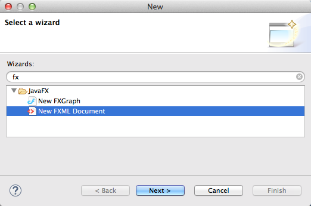
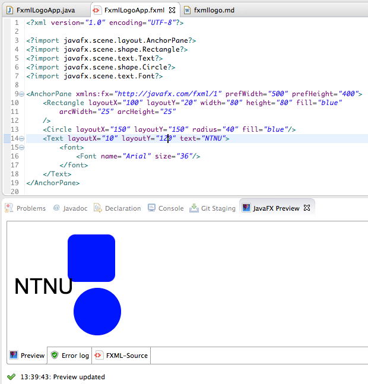
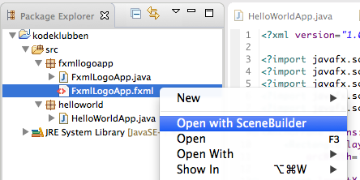
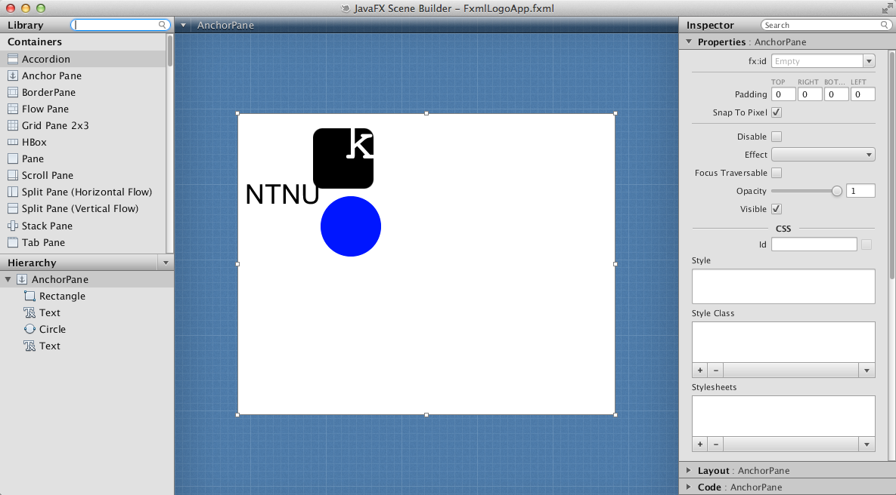
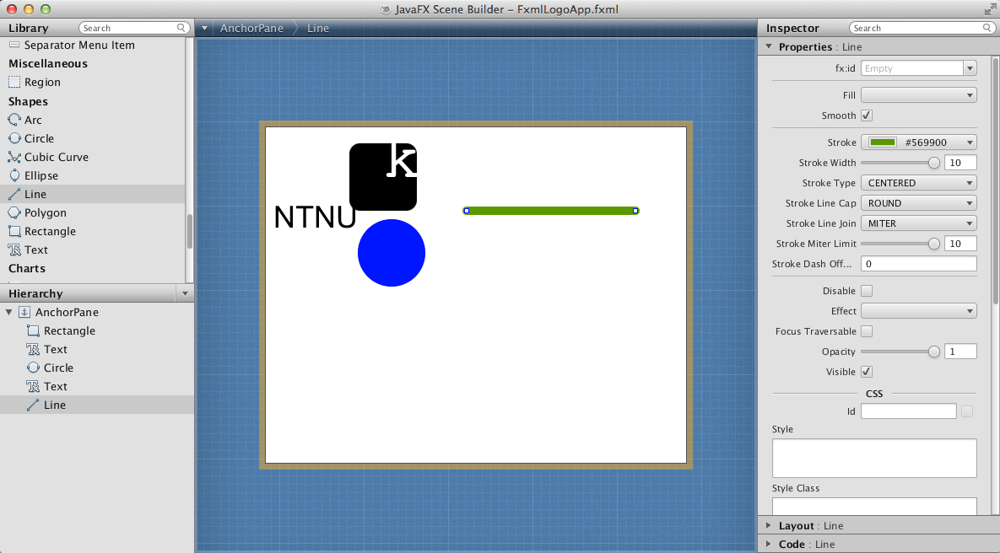
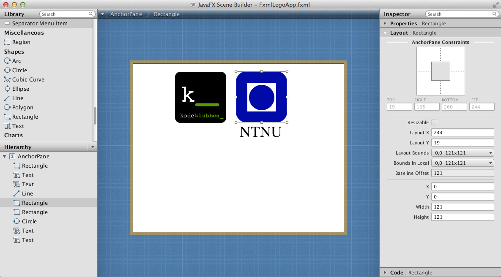
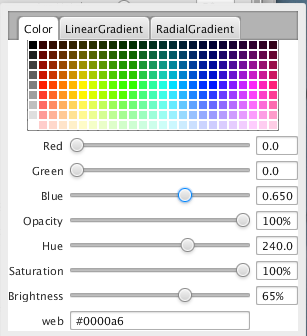
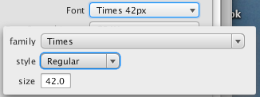
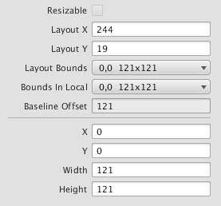
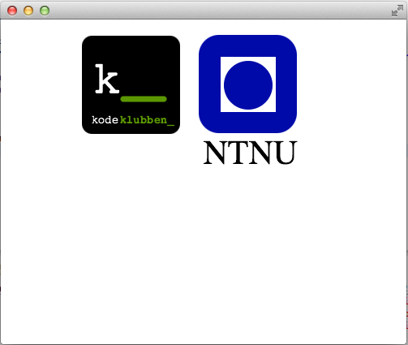

# Introduksjon {.intro}

En viktig del av det å lage app-er er å utforme skjerminnholdet, dvs. alt app-en inneholder av grafikk, knapper, lister, osv. Formålet til denne leksjonen er å lære hvordan du kan bruke **FXML** for å lage skjerminnhold, og **to måter** å lage slikt innhold. I tillegg skal du lære hvordan du får app-en til å last inn og vise frem innholdet i FXML-filer. App-en er ikke så komplisert, den skal bare vise frem logoene til Kodeklubben og NTNU (eller andre logoer, hvis du ønsker det):

| Kodeklubben | NTNU |
|:--------:|:---------:|
|  |  |

I leksjonen [Hello world](../helloworld/helloworld.html) lærte du om hvordan du kan lage en app som viste et vindu med et tekst-objekt (av type **Text**). Da skrev du Java-kode som _laget_ tekst-objektet, _satte grafiske egenskaper_ for tekst-objektet og _la det til_ app-vinduet. Slik kode kan fort bli lang og uoversiktlig, og det kan være vanskelig å skrive kode som har ønsket effekt og se for seg hvordan skjerminnholdet vil bli seende ut.

For å gjøre arbeidet med skjerminnhold enklere, så finnes det en egen kode-type kalt **FXML** for å lage skjerminnhold. FXML ligner på HTML ved at det bruker XML-elementer, f.eks. `<Text ...> ... </Text>` og attributter, f.eks. `fill="blue"` for å beskrive innholdet. Når en skal lage FXML-filer, kan en enten redigere FXML som tekst i en egen FXML-editor eller bruke en egen tegne-app som leser og skriver FXML-filer. Vi skal se på begge disse teknikkene i denne leksjonen.

# Steg 1: Opprette app-pakke, app-klasse og FXML-fil {.activity}

+ Lag først en ny app-pakke og app-klasse som forklart i [Hello world-leksjonen](../helloworld/helloworld.html). Bruk **fxmllogo** som navn på pakken og **FxmlLogoApp** som navn på app-klassen.

+ Høyreklikk på **fxmllogo**-pakken og velg `New > Other...` så du får opp en liste med såkalte _veivisere_ (eng: _wizards_). Vi skal bruke den som heter **New FXML Document**. Det enkleste er å skrive inn 'fx' i søkefeltet, for å snevre inn utvalget:

<<<<<<< HEAD
	
<<<<<<< HEAD
=======
	
>>>>>>> Glemte md-filene...
	
=======

>>>>>>> upstream/master
	Trykk `Next` for å velge veiviseren. Du vil da få opp følgende skjema:

	

	Fyll inn `FxmlLogoApp` og trykk `Finish`. Du vil da få opp en FXML-editor med den nye FXML-fila:

	

+ Denne FXML-en gir bare et tomt panel (av typen **AnchorPane**), så for å få noe å jobbe med, så trenger vi  Rediger teksten slik at den blir som følger:

	```xml
<AnchorPane xmlns:fx="http://javafx.com/fxml/1" prefWidth="500" prefHeight="400">
	<Rectangle layoutX="100" layoutY="20" width="80" height="80" fill="black"
		arcWidth="25" arcHeight="25"
	/>
	<Text layoutX="140" layoutY="60" text="k" fill="white">
		<font>
			<Font name="Courier" size="72"/>
		</font>
	</Text>
	<Circle layoutX="150" layoutY="150" radius="40" fill="blue"/>
	<Text layoutX="10" layoutY="120" text="NTNU">
		<font>
			<Font name="Arial" size="36"/>
		</font>
	</Text>
</AnchorPane>
```

	FXML-editoren har samme type kode-komplettering som Java-editoren. Når du f.eks. har skrevet inn `<Rect`, kan du trykk ctrl-mellomrom og editoren vil både fylle ut resten av **Rectangle**-navnet og legge til en import-setning øverst i fila (tilsvarende import-setningen i Java):

	`<?import javafx.scene.shape.Rectangle?>`

<<<<<<< HEAD
	(Hvis du ikke bruker kode-kompletteringsfunksjonen, så må du skrive inn import-setningen selv.) Tilsvarende kan du bruke kode-komplettering på attributt-navnene **layoutX**, **layoutY**, **width**, **height**, **fill** osv. 
=======
	(Hvis du ikke bruker kode-kompletteringsfunksjonen, så må du skrive inn import-setningen selv.) Tilsvarende kan du bruke kode-komplettering på attributt-navnene **layoutX**, **layoutY**, **width**, **height**, **fill** osv.
>>>>>>> upstream/master

+ Mens du redigerer FXML-koden, så kan det være kjekt å se hvordan innholdet vil bli seende ut, når det lastes inn og vises frem. Eclipse har et eget panel kalt **JavaFX preview** som hele tiden laster inn FXML-koden du redigerer og viser frem innholdet. Dette åpnes ved å velge `Window > Show View...` og så finne panelet i lista. Bruk søkefeltet for å filtrere lista (skriv 'pre', så panelet blir enklere å finne.

<<<<<<< HEAD
	
<<<<<<< HEAD
=======
	
>>>>>>> Glemte md-filene...
	
=======
>>>>>>> upstream/master
	Som du ser så inneholder FXML-fila allerede mange av de grafiske elementene som trengs for å lage begge logoene, men ikke alle. Din jobb blir å justere på FXML-koden, så logoene blir omtrent som vist øverst i denne leksjonen.

## Litt om FXML

Du har kanskje kjent igjen mange av ordene i FXML-fila fra Java-koden du skrev i [Hello world-leksjonen](../helloworld/helloworld.html), og det er ikke tilfeldig. Enkelt sagt så tilsvarer elementnavnene i FXML-koden (ordet etter `<` og `</`), f.eks. **Text** og **Rectangle** Java-klasser, og attributtnavnene tilsvarer egenskaper, f.eks. **layoutX**, **width** og **fill**. Det er også noen elementnavn som tilsvarer egenskaper, f.eks. **font**. Når FXML-koden blir lest inn, så vil hvert element som tilsvarer en Java-klasse bli til en instans (et Java-objekt) av den klassen, og hvert attributt bli brukt til å sette en egenskap, som om en brukte tilsvarende **set**-metode. Følgende Java- og FXML-kode betyr omtrent det samme:

```java
Circle circle = new Circle();
circle.setLayoutX(150);
circle.setLayoutY(150);
circle.setRadius(40);
circle.setFill(Color.BLUE);
```

```xml
<Circle layoutX="150" layoutY="150" radius="40" fill="blue"/>
```

Noen typer objekter, f.eks. paneler (typene **Pane**, **HBox**, **VBox** og **AnchorPane**), _inneholder_ andre objekter. I Java-koden må en legge den ene til **children**-lista til den andre, mens en i FXML legger det ene elementet inni det andre:

```java
Pane pane = new Pane();
Circle circle = new Circle();
...
pane.getChildren().add(circle);
```

```xml
<Pane>
	<Circle layoutX="150" layoutY="150" radius="40" fill="blue"/>
</Pane>
```

# Steg 2: Åpne og redigere FXML-fil med SceneBuilder {.activity}

Det går greit å bruke FXML-editoren for enkel redigering (eller mer kompliserte ting, når en får erfaring), men det finnes et enklere alternativ, nemlig en grafisk editor kalt **SceneBuilder**. En kan faktisk åpne og redigere FXML-fila direkte i JavaFX Scene Builder (ofte bare kalt SceneBuilder), siden den bruker FXML som lagringsformat.

+ Høyreklikk på FXML-fila og velg `Open with SceneBuilder`

	

	Hvis du har installer SceneBuilder riktig, så skal du etter litt venting få opp følgende

	

	Som du ser så inneholder panelet i midten de samme grafiske elementene som JavaFX Preview-panelet. Her kan du imidlertid _redigere_ på dem, ved å velge, dra og slippe, som i vanlige tegneprogrammer.
<<<<<<< HEAD
	
	Nederst til venstre ser du trestrukturen av objekter, med et panel (**AnchorPane**) som inneholder et rektangel (**Rectangle**), en sirkel (**Circle**) og to tekst-objekter (**Text**). 
	
	Øverst til venstre ser du en kategorisert liste med elementer som kan dras og slippes inn i redigeringspanelet i midten. I figuren vises bare såkalte **Containers**, som inneholder andre elementer, men (hvis du scroller) lenger ned finner du bl.a. **Controls** (interaktive elementer) og **Shapes** (grafiske elementer). Prøv å finne **Line**-typen og dra og slipp den litt til høyre for det svarte rektangelet. Hvis du vil endre på hvordan streken ser ut, så kan du redigere ulike _egenskaper_ i panelet til høyre. Prøv f.eks. å gjøre streken tykkere (**Stroke Width** = 10), endre fargen til grønn (**Stroke** = #569900) og enden til avrundet (**Stroke Line Cap** = **ROUND**). Da skal det se omtrent slik ut:

	
	
	Dette er omtrent de grafiske elementen du trenger for å lage Kodeklubben- og NTNU-logoene. Prøv å bruke redigeringsmulighetene til å få tegningen til å bli seende omtrent slik ut:
	
<<<<<<< HEAD
=======

	Nederst til venstre ser du trestrukturen av objekter, med et panel (**AnchorPane**) som inneholder et rektangel (**Rectangle**), en sirkel (**Circle**) og to tekst-objekter (**Text**).

	Øverst til venstre ser du en kategorisert liste med elementer som kan dras og slippes inn i redigeringspanelet i midten. I figuren vises bare såkalte **Containers**, som inneholder andre elementer, men (hvis du scroller) lenger ned finner du bl.a. **Controls** (interaktive elementer) og **Shapes** (grafiske elementer). Prøv å finne **Line**-typen og dra og slipp den litt til høyre for det svarte rektangelet. Hvis du vil endre på hvordan streken ser ut, så kan du redigere ulike _egenskaper_ i panelet til høyre. Prøv f.eks. å gjøre streken tykkere (**Stroke Width** = 10), endre fargen til grønn (**Stroke** = #569900) og enden til avrundet (**Stroke Line Cap** = **ROUND**). Da skal det se omtrent slik ut:

	

	Dette er omtrent de grafiske elementen du trenger for å lage Kodeklubben- og NTNU-logoene. Prøv å bruke redigeringsmulighetene til å få tegningen til å bli seende omtrent slik ut:

>>>>>>> upstream/master
	
=======
	
>>>>>>> Glemte md-filene...

	Her er noen tips om nyttige redigeringsfunksjoner som du kan bruke for å få laget og redigert grafikken:

	* Du kan raskt lage en kopi (duplisere) et element med `Edit > Duplicate`
	* Du kan runde av hjørnene på et rektangel ved å endre **Arc Height** og **Arc Width**
	* Når du klikker på **Stroke**- og **Fill**-egenskapene, så kommer det opp et nytt vindu med mulighet til å velge farge på flere måter (se under til venstre)
	* Tilsvarende kan du stille inn navn og størrelsen på font-en til tekst-objekter ved å klikke på **Font**-egenskapen (se under til høyre)
<<<<<<< HEAD
	
	| Valg av farge | Valg av font |
	|:-------------:|:------------:|
	|||
	
	Spesielt fin-innstillingen av plassering og dimensjoner kan være vanskelig. Nede til høyre i SceneBuilder-vinduet finner du egenskaper med kategorien **Layout**, bl.a. koordinater og størrelse. Akkurat hvilke egenskaper du kan endre avhenger av hvilket grafisk element som er valgt. I figuren under ser du hva som kan endre på et rektangel.
	
=======

	| Valg av farge | Valg av font |
	|:-------------:|:------------:|
	|||

	Spesielt fin-innstillingen av plassering og dimensjoner kan være vanskelig. Nede til høyre i SceneBuilder-vinduet finner du egenskaper med kategorien **Layout**, bl.a. koordinater og størrelse. Akkurat hvilke egenskaper du kan endre avhenger av hvilket grafisk element som er valgt. I figuren under ser du hva som kan endre på et rektangel.

>>>>>>> upstream/master
	| Layout-egenskaper |  |
	|:-------------:|------------|
	|| Det er egentlig disse egenskapene du endrer, når du velger, drar og slipper de grafiske elementene og de små hjørne-boksene. Ved å redigere tallene, så kan du styre dem helt presist.|

# Steg 3: Få appen til å vise frem innholdet i FXML-fila  {.activity}

Det siste trinnet i denne leksjonen er å få app-en til å vise frem det grafiske innholdet i app-vinduet. For å få dette til må du redigere koden i app-klassen din, som du laget i trinn én og heter **FxmlLogoApp**.

+ Husk å lagre FXML-fila i SceneBuilder før du går tilbake til Eclipse.
+ Klikk i FXML-editoren. Den skal da vise frem det nye innholdet, som er resultatet av all redigeringen du gjorde i SceneBuilder.
+ Det er greit å gjøre endringer rett i FXML-koden i editor. Når du går tilbake til SceneBuilder, så sjekk om du ser de samme endringene der. Hvis ikke så må du kanskje lukke den og åpne den igjen med `Open with SceneBuilder`.
+ Velg editoren med **FxmlLogoApp**-klassen i (eller åpne den ved å dobbel-klikke på **FxmlLogoApp.java**) og rediger slik at du får følgende kode:
	```java
	package fxmllogoapp;

	import java.io.IOException;

	import javafx.application.Application;
	import javafx.fxml.FXMLLoader;
	import javafx.scene.Scene;
	import javafx.scene.layout.Pane;
	import javafx.stage.Stage;

	public class FxmlLogoApp extends Application {

		public void start(Stage primaryStage) throws IOException {
			FXMLLoader fxmlLoader = new FXMLLoader(FxmlLogoApp.class.getResource("FxmlLogoApp.fxml"));
			Pane root = fxmlLoader.load();
        	primaryStage.setScene(new Scene(root));
        	primaryStage.show();
		}

		public static void main(String[] args) {
			launch(FxmlLogoApp.class, args);
		}
	}
```

	Trikset her er å lage et **FXMLLoader**-objekt (første linje i start-metoden, og be denne laste inn FXML-fila med load-metoden (andre linje).
+ Kjør app-en ved å høyre-klikke på fila eller i editoren og velge `Run as > Java Application`. Da skal det (etter litt venting) dukke opp et vindu som dette:

	

# Hva har du lært?

+ lage en FXML-fil med Eclipse sin veiviser
+ redigere FXML i Eclipse sin FXML-editor.
+ se forhåndsvisning av FXML-innholdet i JavaFX Preview-panelet
+ åpne FXML-fila i JavaFX Scene Builder med `Open with SceneBuilder`
<<<<<<< HEAD
+ legge nye elementer til FXML-fila ved å dra og slippe fra SceneBuilder sin paletten 
+ redigere grafiske egenskaper i SceneBuilder
+ skrive app-kode som laster inn og viser frem FXML-fila i et app-vindu

I leksjonen [KalkulatorFX](../kalkulatorfx/kalkulatorfx.html) vil du lære hvordan du kan koble FXML-koden til Java-koden og gjøre app-en levende (interaktiv)!
=======
+ legge nye elementer til FXML-fila ved å dra og slippe fra SceneBuilder sin paletten
+ redigere grafiske egenskaper i SceneBuilder
+ skrive app-kode som laster inn og viser frem FXML-fila i et app-vindu

I leksjonen KalkulatorFX (to be continued) vil du lære hvordan du kan koble FXML-koden til Java-koden og gjøre app-en levende (interaktiv)!
>>>>>>> upstream/master
