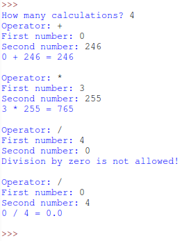

# Kalkulator {.intro}

I denne oppgaven skal du lage en kalkulator helt på egenhånd. Det er meningen at du  i denne oppgaven skal skrive all koden selv, ved hjelp av noen hint.

Vi ønsker at kalkulatoren skal kunne addere (`+`), subtrahere (`-`), multiplisere (`*`) og dividere (`/`). Vi kaller `+`, `-`, `*` og `/` for *operatorer*, og i denne oppgaven skal du lage en funksjon for hver operator (disse kan du for eksempel kalle `add`, `subtract`, `multiply` og `divide`. Hver funksjon skal ha 2 tall som parametre og skal utføre regneoperasjonen før den så skriver ut svaret.

Brukeren skal selv skrive inn hva slags regneoperasjon som skal utføres.

Eksempel på bruk av programmet:

# Klar, ferdig, programmer! {.activity}

Da er det bare å sette i gang!

Her er noen ting å tenke på:

* Hvordan avgjør du hvilken operasjon som skal utføres?
* Har rekkefølgen på tallene noen betydning? (Er `4-2` lik `2-4`?)

# Test programmet {.activity}

Fungerer programmet som det skal? Hvis ikke må du rette på det.

## Delt på null {.challenge}

Hva skjer når du deler på null? Prøv for eksempel `4 / 0`.

Hvis programmet ditt feiler nå, så har du trolig fått en delt-på-null-feil. Man kan nemlig ikke dele på null. Fiks programmet ditt slik at programmet skriver ut `"Division by zero is not allowed!"` hvis brukeren forsøker å dele på null. Slik:

## Flere utregninger {.challenge}

Endre programmet ditt slik at brukeren kan skrive inn hvor mange utregninger kalkulatoren skal utføre. Programmet vil da fungere slik:

